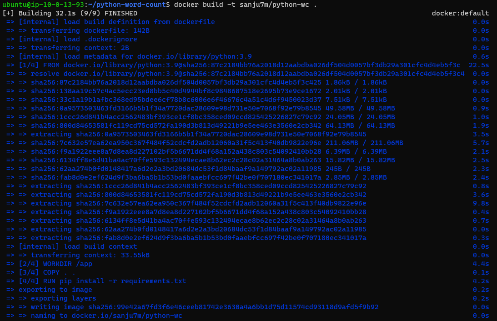
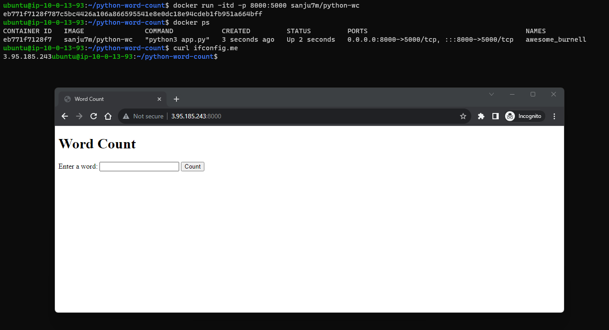

# Project Title

This project demonstrates the process of Dockerizing a simple Python application, pushing the Docker image to Docker Hub, and then running the container. The application within the container listens on port 5000 internally, but you can access it on any port of your choice.




## Getting Started

Follow these instructions to get the project up and running on your local machine for development and testing purposes.

### Prerequisites

- Ensure you have Docker installed on your machine. If not, download and install Docker from [here](https://www.docker.com/get-started).
- A Docker Hub account to host your Docker images. Create an account [here](https://hub.docker.com/) if you don't have one.

### Files in the Repository

- `Dockerfile`: Contains the instructions for building the Docker image.
- `app.py`: The main Python application file.
- `requirements.txt`: Lists the Python dependencies required by `app.py`.

### Building the Docker Image

1. Navigate to the project directory.
2. Create a file named `Dockerfile` with the following content:

```Dockerfile
FROM python:3.9

WORKDIR /app

COPY . .

RUN pip install -r requirements.txt

CMD ["python3", "app.py"]
```

3. Save the file, then build the Docker image by executing the following command in your terminal:

```bash
docker build -t your-dockerhub-username/project-name .
```

### Pushing the Docker Image to Docker Hub

1. Log in to Docker Hub using the following command and provide your Docker Hub credentials when prompted:

```bash
docker login
```

2. Push your Docker image to Docker Hub with the following command:

```bash
docker push your-dockerhub-username/project-name
```

### Running the Docker Container

1. If the Docker image isn't on your machine, pull it from Docker Hub with the following command:

```bash
docker pull your-dockerhub-username/project-name
```

2. Now, run the Docker container, mapping an external port of your choice to the internal port 5000:

```bash
docker run -d -p external-port:5000 your-dockerhub-username/project-name
```

### Accessing the Application

Access the application by navigating to `http://localhost:external-port` in your web browser.

## Authors

- Sanjeev Malik
